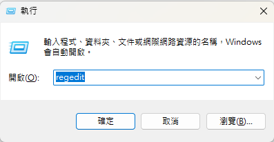
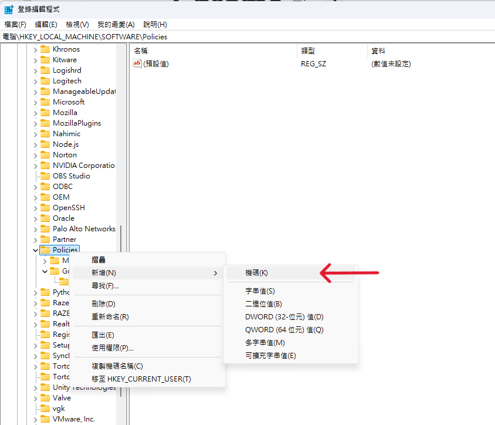
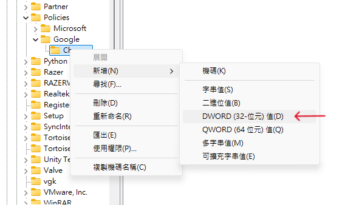
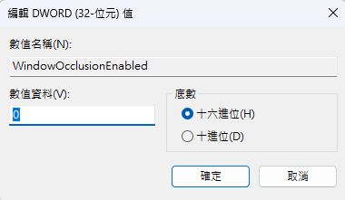
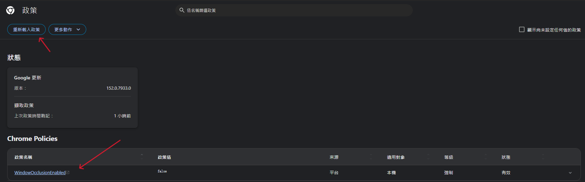

# 如何讓Chrome瀏覽器視窗在被遮蔽時繼續渲染

以下內容適用於 `Chrome 152` 版本、`Windows` 作業系統

## 原理說明

預設情況下，當一個視窗進入背景(被其他視窗遮蔽)，Chrome瀏覽器就會**停止渲染**該視窗畫面，來減少資源的消耗，僅保留音訊的輸出。  

以下設定的目的，是讓瀏覽器「**不再偵測視窗是否被其他視窗遮蔽**」，使停止渲染的機制失效。

> 本文設定**不適用**於「視窗最小化」

## 適合情境

本文設定適合，希望畫面持續渲染與更新的人，例如:  

*  遊玩網頁遊戲，切窗時想要保持畫面持續更新。
*  擷取、錄製某視窗畫面，切窗時要保持錄製正常進行。
*  執行 Canvas、WebGL、動畫或其他需要持續更新畫面的網頁內容。
  

## 操作步驟

1. 快捷鍵 `win + R` => 輸入 `regedit` => 開啟**登錄編輯程式**

    

2. 找到 `電腦\HKEY_LOCAL_MACHINE\SOFTWARE\Policies\Google\Chrome`  
(如果沒有，需要自己新增`機碼`)

    

3. 右鍵 -> 新增 -> `DWORD (32 位元) 值`  

    

4. 命名為 `WindowOcclusionEnabled`、值設置為 `0`。 (10進位或是16進位都可以)

    
    

5. 到Chrome瀏覽器 -> 打開 `chrome://policy` -> **重新載入政策**
6. 確認`WindowOcclusionEnabled`政策已被載入，政策值是`false`。

    

## 還原設置

如果之後沒有在被遮蔽時繼續渲染畫面的需求，想回復設定，只需要以同樣的步驟將 `WindowOcclusionEnabled`政策的值設定為`1`即可。

## 注意事項

強迫瀏覽器持續渲染畫面，需要以電腦效能作為代價交換。可能導致CPU、GPU使用率上升，耗電量增加，記憶體等資源使用量增加。  

**因此建議除非有特殊需求，否則依照瀏覽器原始設置即可。**